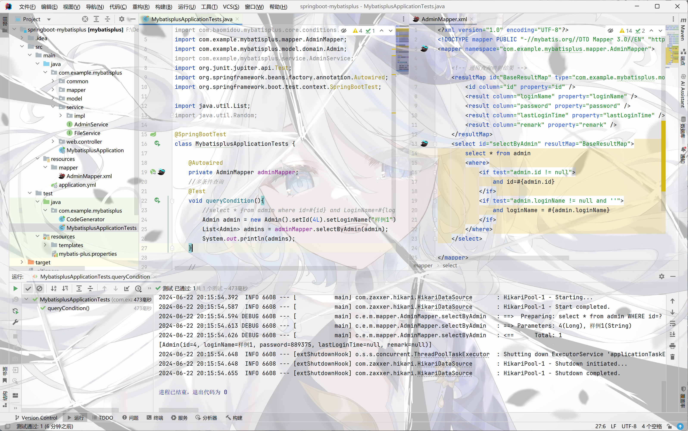

# Day2作业

1. 动态sql-ifwhere和forEach练习（多条件查询，批量删除，批量添加）

2. 两种连接查询

## 多条件查询

- 单元测试中进行测试

  ```java
  void queryCondition(){
          //select * from admin where id=#{id} and LoginName=#{loginName}
          Admin admin = new Admin().setId(4L).setLoginName("样例1");
          List<Admin> admins = adminMapper.selectByAdmin(admin);
          System.out.println(admins);
      }
  ```

``` xml

<select id="selectByAdmin" resultMap="BaseResultMap">
        select * from admin
        <where>
            <if test="admin.id != null">
                and id=#{admin.id}
            </if>
            <if test="admin.loginName != null and ''">
                and loginName = #{admin.loginName}
            </if>
        </where>
    </select>

```



##  批量删除

- 单元测试中进行测试

  ``` java
  
  ```

  